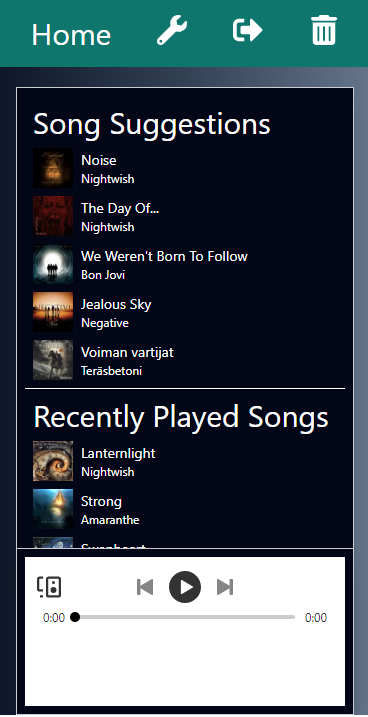

# 🎵 Music Recommender Application

This is a music recommendation web application as part of my thesis project. It is built with [Next.js](https://nextjs.org/) that uses [Spotify's Web API](https://developer.spotify.com/documentation/web-api/) to provide personalized song suggestions based on your listening history and preferences. Authentication is handled using [NextAuth.js](https://next-auth.js.org/), with Spotify as the provider. A recommender algoritm is built for the application in order to suggest songs. The algoritm calculates similarities of tracks using Euclidean distance.
Actual algoritm code can be found under `src/lib/functions`.

## 🚀 Features

- **Spotify Authentication**: Secure login using your Spotify account with NextAuth.
- **Personalized Recommendations**: Get song recommendations based on your Spotify listening history.
- **Song Playback**: Listen to your tracks directly from the application.
- **User Preferences**: Customize your music preferences (e.g., key, tempo) to refine song suggestions.
- **User's Listening History**: Review your recent listening history from Spotify.
  
## 🛠️ Built With

- **[Next.js](https://nextjs.org/)** - React framework with server-side rendering (SSR) and static site generation (SSG).
- **[NextAuth.js](https://next-auth.js.org/)** - Authentication library for Next.js, using Spotify as an OAuth2 provider.
- **[Spotify Web API](https://developer.spotify.com/documentation/web-api/)** - Fetch listening history and get song recommendations.
- **React Context** - Manage authentication state globally.
  
## 🎯 Prerequisites

- [Spotify Account](https://open.spotify.com/) to create a Spotify account.
- For full experience, Spotify Premium is recommended.
- If you want to try out the music-recommender-app, please send me your email that is used in your Spotify Account. This is required for now, otherwise the app won't let you authorize.

## Screenshots

### Dashboard in mobile view

## How to use

The app is hosted at https://music-recommender-app.vercel.app/.

